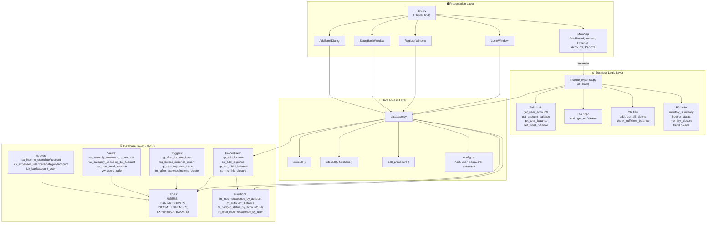
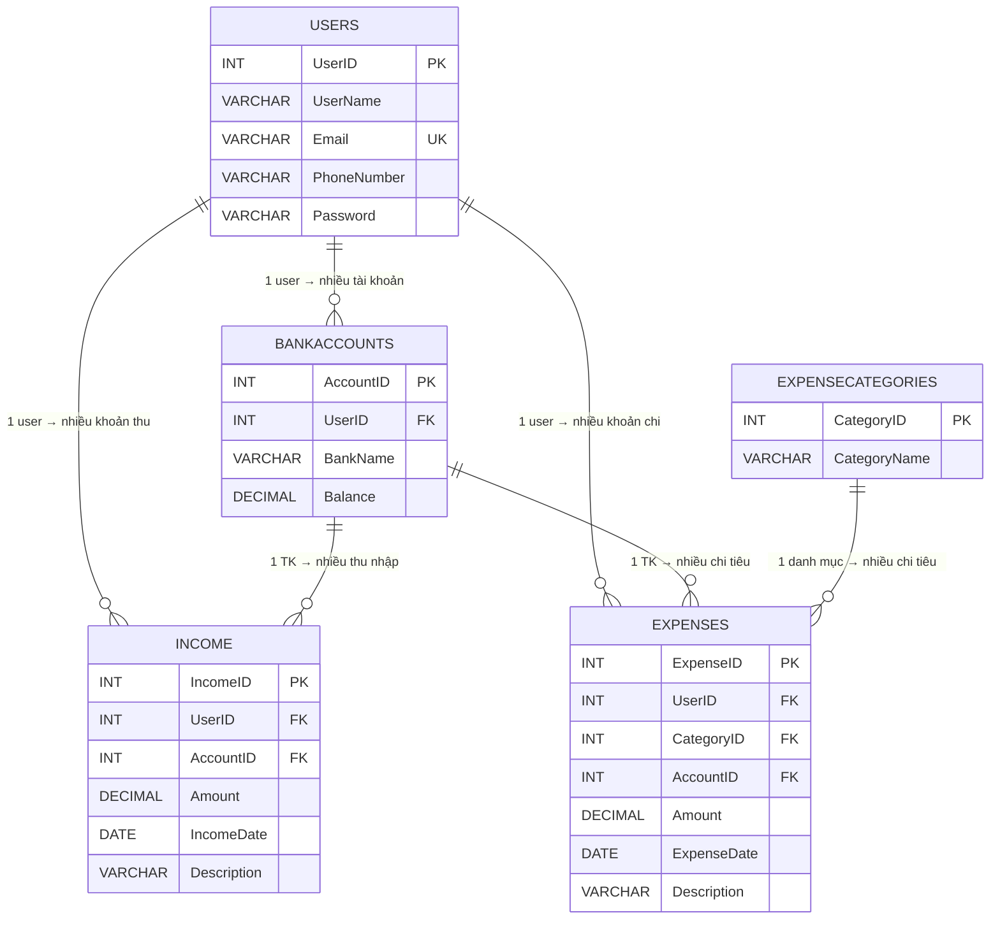
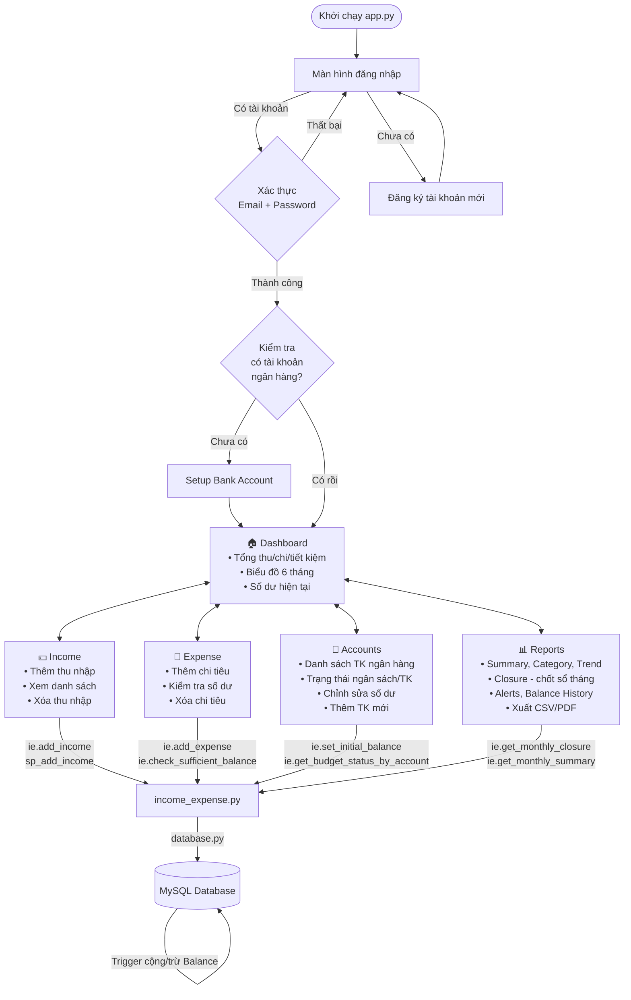
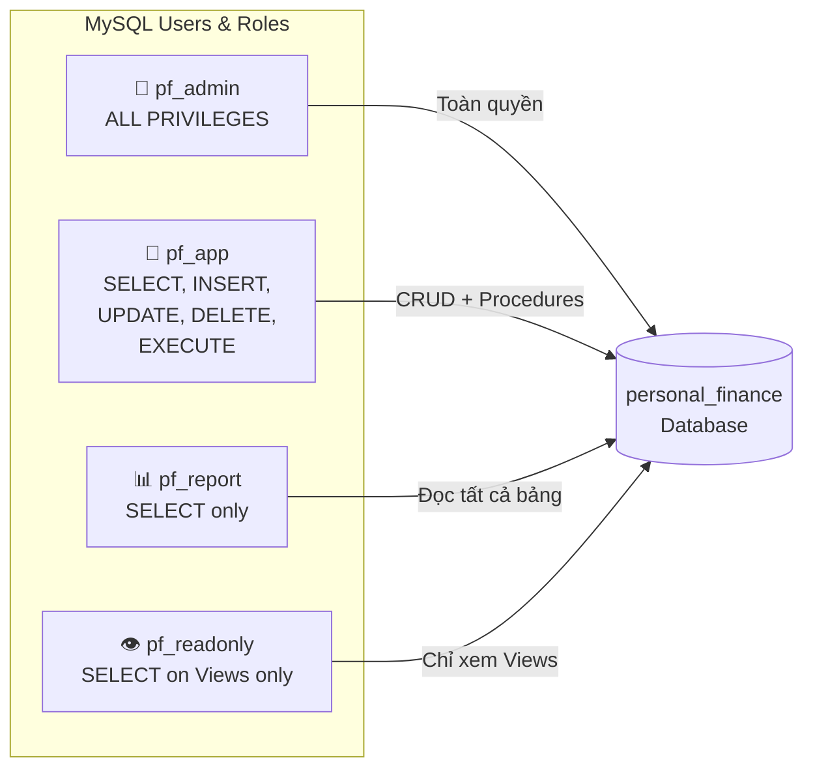

# 🏦 Personal Finance Management System — Sơ đồ Kiến trúc

## 1. Cấu trúc Thư mục (Folder Structure)

```
personal_finance_project/
│
├── 📁 sql/                          ← Tầng Cơ sở dữ liệu (Database Layer)
│   ├── structure&data.sql           ← Tạo bảng + dữ liệu mẫu (10 records/bảng)
│   ├── advanced.sql                 ← Index, View, Function, Procedure, Trigger
│   └── admin&security.sql           ← Phân quyền user + View bảo mật
│
├── 📁 python/                       ← Tầng Ứng dụng (Application Layer)
│   ├── config.py                    ← Cấu hình kết nối MySQL
│   ├── database.py                  ← Database wrapper (CRUD + call procedure)
│   ├── income_expense.py            ← Business logic (thu nhập, chi tiêu, báo cáo)
│   └── app.py                       ← GUI Tkinter (Login, Register, Dashboard, ...)
│
├── 📁 backup/                       ← Sao lưu dữ liệu
│   ├── personal_finance_backup.sql  ← Backup đầy đủ
│   ├── schema_only.sql              ← Chỉ cấu trúc
│   └── data_only.sql                ← Chỉ dữ liệu
│
└── 📁 .git/                         ← Git version control
```

---

## 2. Kiến trúc Tổng quan (Architecture Overview)



---

## 3. Sơ đồ ERD — Quan hệ giữa các bảng



---

## 4. Luồng hoạt động của ứng dụng (Application Flow)



---

## 5. Phân quyền User trong MySQL



---

## 6. Mô tả chi tiết từng file

| File | Vai trò | Chi tiết |
|------|---------|----------|
| `config.py` | Cấu hình DB | Host, user, password, database name |
| `database.py` | Data Access | Class `Database` với `execute()`, `fetchall()`, `fetchone()`, `call_procedure()`, `close()` |
| `income_expense.py` | Business Logic | **24 hàm**: quản lý tài khoản, thu nhập, chi tiêu, danh mục, báo cáo (summary, budget status, closure, trend, alerts), kiểm tra số dư |
| `app.py` | GUI (~1670 dòng) | 6 class Tkinter + 5 trang (Dashboard, Income, Expense, Accounts, Reports) + 6 tab Reports (Summary, Category, Trend, **Closure**, Alerts, History) |
| `structure&data.sql` | Schema + Seed | 5 bảng + 10 records mẫu mỗi bảng |
| `advanced.sql` | Advanced DB | 8 Index, 3 View, 7 Function, 4 Procedure, 5 Trigger |
| `admin&security.sql` | Security | 4 MySQL users, phân quyền RBAC, View ẩn thông tin nhạy cảm |

---

## 7. Công nghệ sử dụng

| Thành phần | Công nghệ |
|------------|-----------|
| **Database** | MySQL |
| **Backend** | Python 3 |
| **GUI Framework** | Tkinter + ttk |
| **Charting** | Matplotlib (embedded in Tkinter) |
| **DB Connector** | mysql-connector-python |
| **Export** | CSV |
